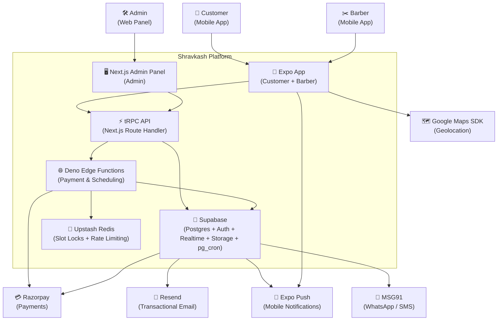
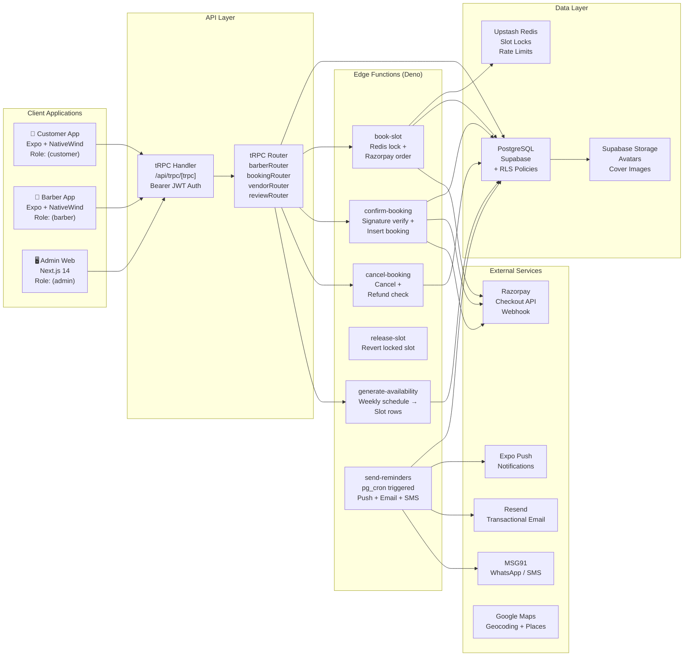
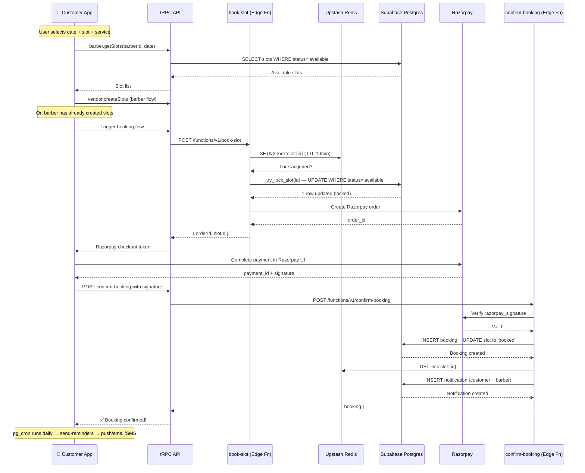
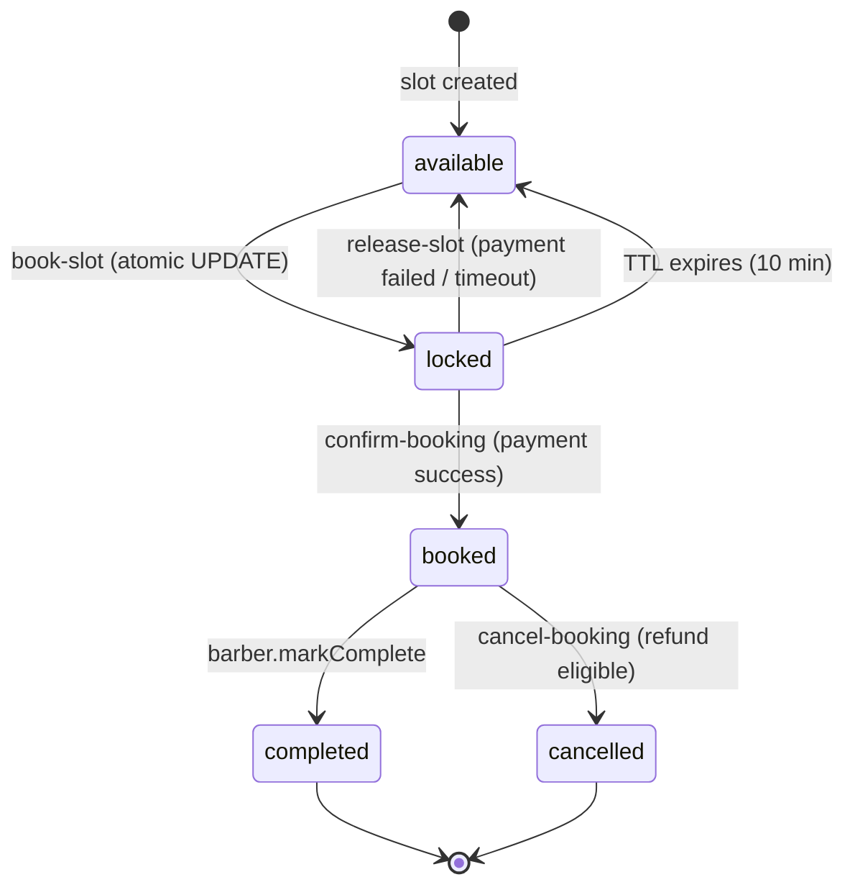
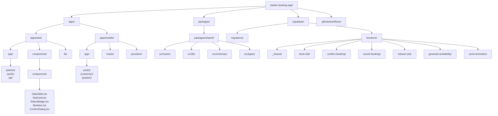

# Shravkash — Architecture Diagram

> This file contains Mermaid diagrams for the Shravkash barber booking platform.
> Render with any Mermaid-compatible viewer (GitHub, VS Code Mermaid extension, Mermaid Preview, etc.)

---

## 1. System Context (C4 Level 1)



---

## 2. Container Architecture (C4 Level 2)



---

## 3. Booking Flow (Sequence Diagram)



---

## 4. Data Model (ER Diagram)

```mermaid
erDiagram
    PROFILES {
        uuid id PK
        text full_name
        text phone
        text avatar_url
        role_t role
        boolean is_banned
        text push_token
    }

    SALONS {
        uuid id PK
        uuid owner_id FK
        text name
        text address
        text city
        float lat
        float lng
        text cover_image_url
        numeric rating
        boolean is_active
    }

    BARBERS {
        uuid id PK
        uuid profile_id FK UK
        uuid salon_id FK
        text bio
        int experience_years
        text avatar_url
        text cover_image_url
        boolean is_available
    }

    SERVICES {
        uuid id PK
        uuid barber_id FK
        text name
        text description
        int duration_minutes
        numeric price
    }

    SLOTS {
        uuid id PK
        uuid barber_id FK
        timestamptz start_time
        timestamptz end_time
        slot_status status
    }

    BOOKINGS {
        uuid id PK
        uuid slot_id FK UK
        uuid service_id FK
        uuid customer_id FK
        uuid barber_id FK
        booking_status status
        text payment_id
        payment_status_t payment_status
        numeric total_amount
        text notes
        timestamptz created_at
    }

    REVIEWS {
        uuid id PK
        uuid booking_id FK UK
        uuid customer_id FK
        uuid barber_id FK
        int rating
        text comment
    }

    PAYOUTS {
        uuid id PK
        uuid barber_id FK
        date period_start
        date period_end
        numeric gross_amount
        numeric commission_amount
        numeric net_amount
        payout_status status
    }

    NOTIFICATIONS {
        uuid id PK
        uuid user_id FK
        text type
        text title
        text body
        jsonb data
        boolean read
    }

    PROFILES ||--o{ SALONS : "owns"
    PROFILES ||--o| BARBERS : "is"
    SALONS ||--o{ BARBERS : "contains"
    BARBERS ||--o{ SERVICES : "offers"
    BARBERS ||--o{ SLOTS : "has"
    BARBERS ||--o{ BOOKINGS : "receives"
    BARBERS ||--o{ REVIEWS : "receives"
    BARBERS ||--o{ PAYOUTS : "receives"
    PROFILES ||--o{ BOOKINGS : "makes"
    PROFILES ||--o{ REVIEWS : "writes"
    PROFILES ||--o{ NOTIFICATIONS : "receives"
    SLOTS ||--o| BOOKINGS : "occupied by"
    BOOKINGS ||--o| REVIEWS : "generates"
    SERVICES ||--o| BOOKINGS : "selected in"
```

---

## 5. Slot Locking — State Machine



---

## 6. Directory Structure



---

*Render this file with a Mermaid-compatible viewer for all diagrams.*
